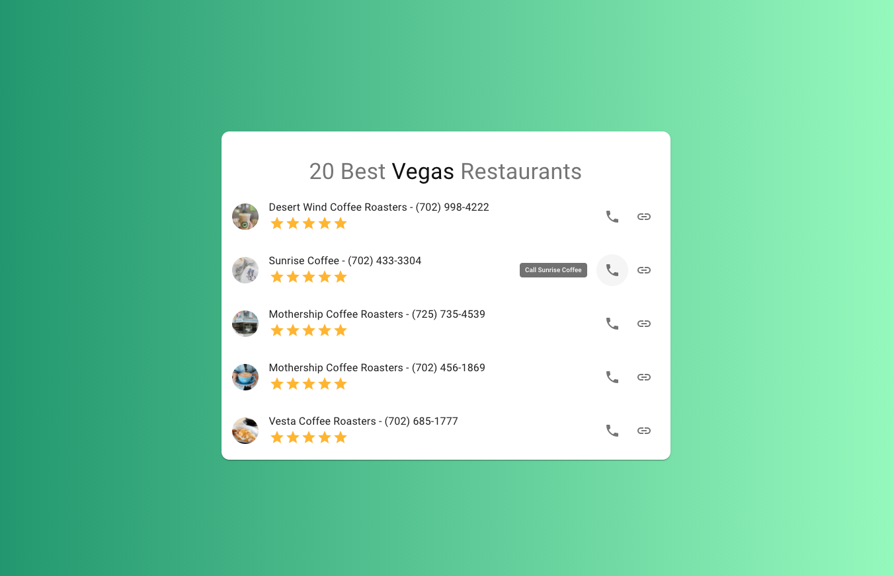

# Yelp API Test
A quick example showing the use of React-Query/Axios to retrieve data from an API.

## To Run Project:
In the project directory, you can run:

### `yarn install`
and then:
### `yarn start`

Runs the app in the development mode.\
Open [http://localhost:3000](http://localhost:3000) to view it in the browser.

#### *Notes* 
- Because of Yelp's CORS policy, this demo takes advantage of cors-anywhere. You may have to [visit](https://cors-anywhere.herokuapp.com/corsdemo) and enable to see demo.
- Normally .env files are never included within public projects. The key's within will be disabled.

### Example:
